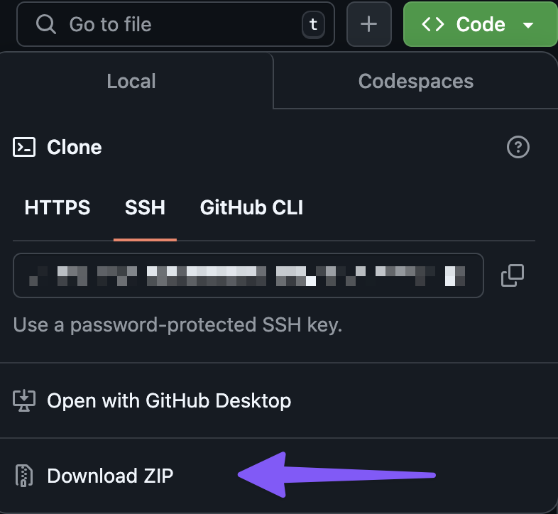

# What is this project?

This project is a prototype open-source toolset for bringing Geographic Information Systems (GIS) expertise to advocates and activists working on housing and sheltering people. Traditionally, GIS expertise and tools would have to be available to these groups and individuals either thorugh payment or volunteer efforts but would only available to the group which arraged or commissioned them.

By making the GIS projects with the idea of sharing them via open-source methods and tools with other interested parties across the world it is possible to create a toolset that would put a wide degree of power directly in the hands of activists and advocates without any GIS expertise or the necessary funds or contacts to procure such assistance. This project aims to create a roadmap for such an endeavor by creating a few simple tools and provding them in a way that follows the principles of open-source software development and distributed collaboration.

# How to use this project

This section describes how to use the project as a consumer of its tools. If you wish to contribute new tools to the project, see the section [How to Contribute](#how-to-contribute) for more information.

## What you will need

### QGIS

You will need to download an open-source project called QGIS. GQIS will provide the GIS processing and mapping interface for each of the tools in this project. The software runs on Windows, MacOS, and Linux making it an excellent choice for nearly all users with a laptop or desktop computer. You can download it at [qgis.org](https://qgis.org). 

Instructions for how to install QGIS on your machine can be found on the same site. Once it is installed you can download this project (if you have not already).

### Download This Project

You have two choices for getting the project resources onto your machine. You can download a zip file or you can clone the repository. If you are unfamiliar with working with Git then downloading a zip file is the most straightforward way to proceed.

Start by clicking on the code button on any page of this code repository (above if you are reading this on GitHub itself)

After clicking it you will see options for cloning the repository or, at the bottom, downloading it as a zip file. Choose that option:

Once downloaded, you can move it to a location where you can work on the contents and unzip it using your preferred method in your OS.

# What Next

Now that you have QGIS installed and this project downloaded to your local computer, you will need to gather data and  run the projects themselves. There is a [guide to collecting the data](./docs/data-sources-guide.md) the project requires and a [guide to getting started](./docs/getting-started-guide.md) with the tools themselves in QGIS. You will need to collect the data first before you can run the tools as they rely on some larger downloads.

# How to Contribute

Contributing to an open-source project is something that Git and GitHub make easy and efficient. You have two options for taking the code and making your own additions to it: [Forking](https://docs.github.com/en/pull-requests/collaborating-with-pull-requests/working-with-forks/fork-a-repo) and [Pull Requests](https://docs.github.com/en/pull-requests). There is [documenation on GitHub](https://docs.github.com/en) for both concepts and which you choose is up to you. If you have tools that you want to contribute to a specific group of activists, then forking and adding your tools is likely the best way to go as this allows you to control the toolset and to allow other developers to contribute to it via pull requests. If you have tools you think belong in this prototype to better demonstrate the capacity of this format, then you can clone the repository and submit a pull request back to the repository owner with your code changes in it for consideration.

# Licensing

This project is licensed using the BSD 3-Clause License which has very few restrictions and provides no warranties or protections. See [LICENSE.md](./LICENSE.md) at the root of the project for more details. 

