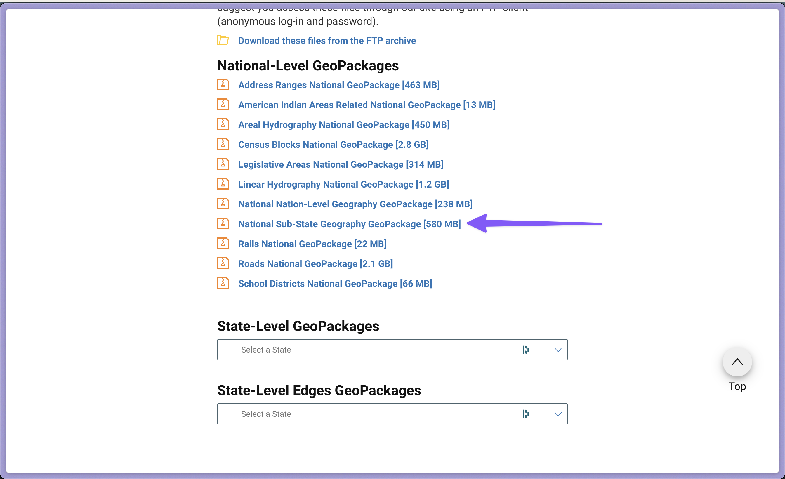
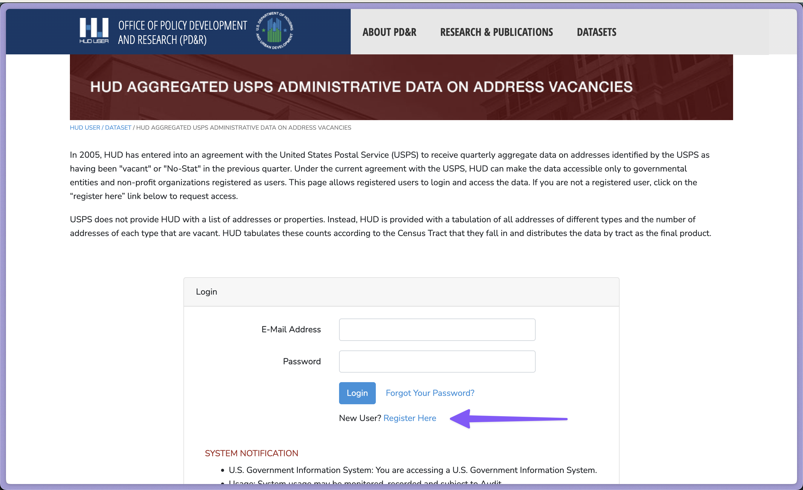
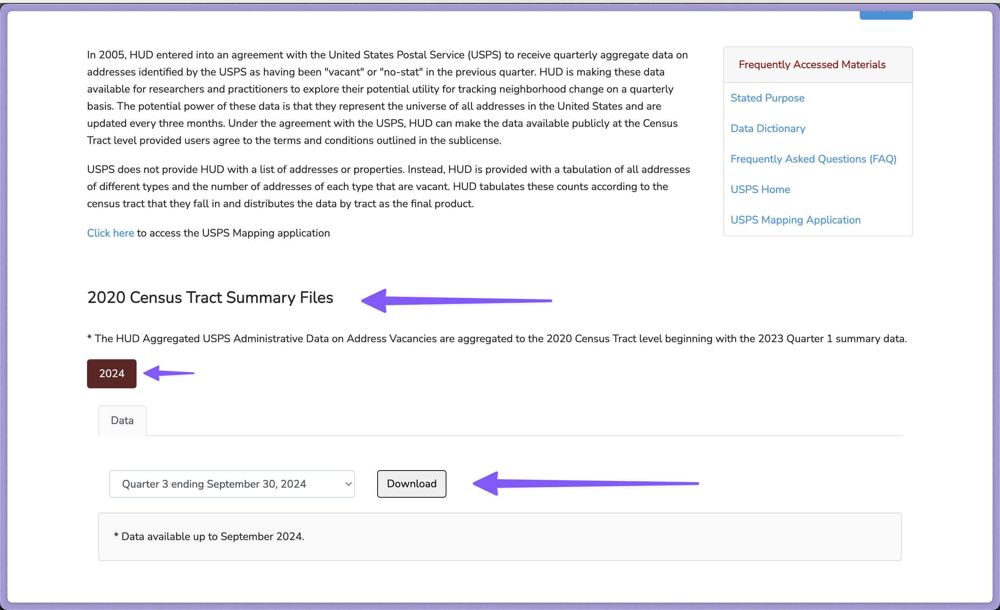
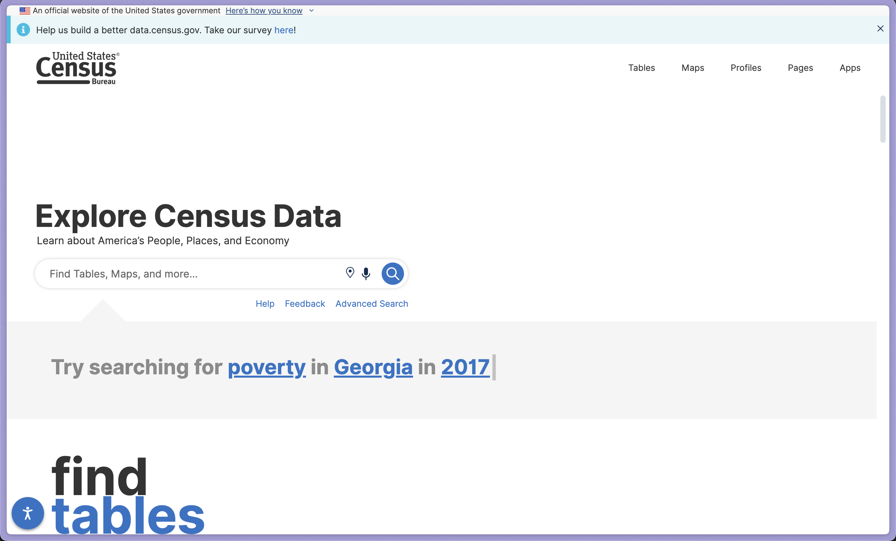
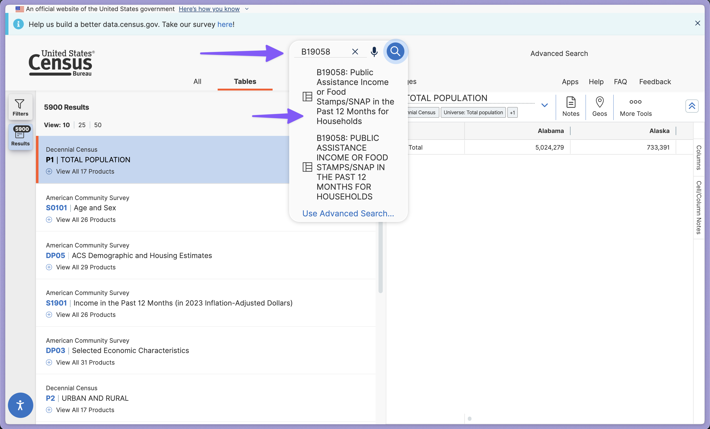
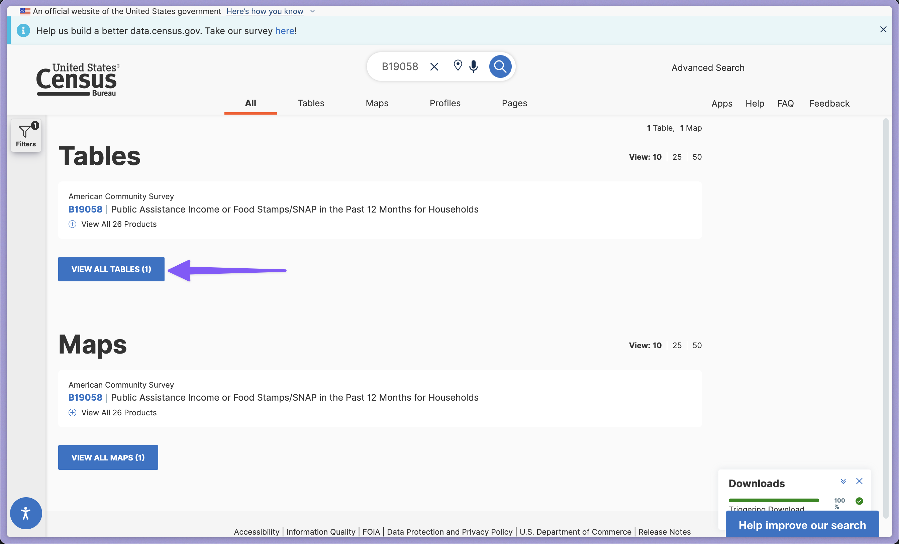
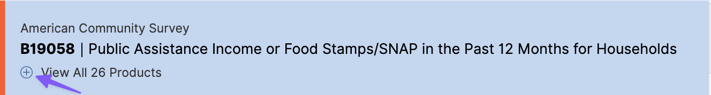
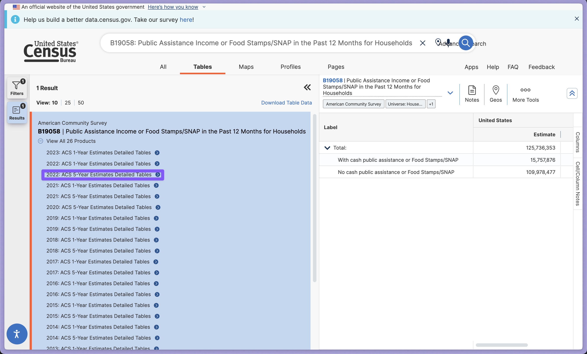
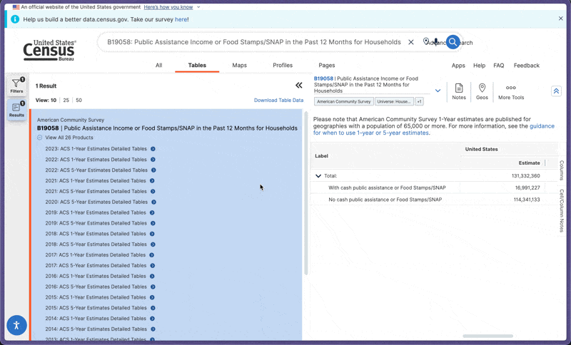
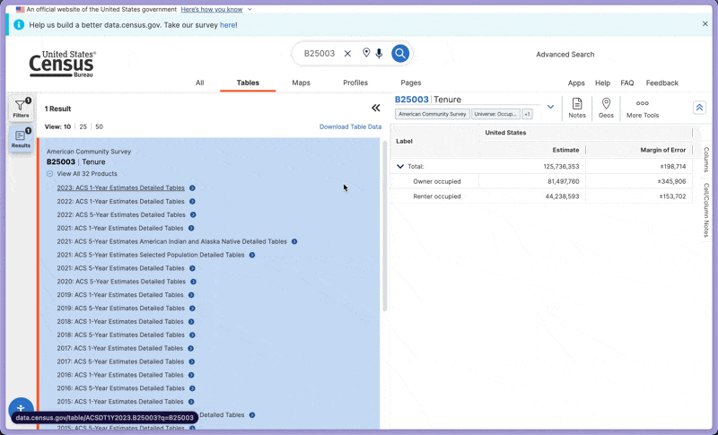

# How to Get Data for the Included Tools

## What Data is Required

### All Tools

All tools in the set require data that defines areas of the United States including state lines and census tract boundaries. This data is provided by the US Census Bureau in the form of their [TIGER/Line GeoPackages](https://www.census.gov/geographies/mapping-files/time-series/geo/tiger-geopackage-file.html). A GeoPackage is a file format that can, among other things, hold geographic data in multiple layers. This allows us to use a single GeoPackage file download to get all the states and census tracts for each of tools.

The file needed is called the National Sub-State Geography GeoPackage. It is found on the main [TIGER/Line GeoPackages](https://www.census.gov/geographies/mapping-files/time-series/geo/tiger-geopackage-file.html) page.

Download this file and unzip it in a location you can access later. Instructions on use for each tool are included in the [Getting Started Guide](./getting-started-guide.md).

### Unoccupied Housing by Census Tract

This tool needs data from a special data set provided by the Department of Housing and Urban Development (HUD). It requires that you fill out a form showing your status as a non-profit entity and that your use will be non-commercial in nature. The data is derived from USPS delivery status indicators and HUD aggregates them by census tract. You can find them on the [HUD Office of Policy Development and Research Site](https://www.huduser.gov/apps/public/usps/login).

Once you have registered and gotten your account setup you can use the login form on that page to access the data. After accepting the license agreement following the login page, you can choose which dataset you want to use. At the creation of the toolset the data was gathered from 2024 which uses the 2020 census tracts.

Download this file and unzip it in a location you can access later. Instructions on use for with the unoccupied housing tool are included in the [Getting Started Guide](./getting-started-guide.md).

### Governmental Assistance by Census Tract

You can get the govermental assistance tool data from the US Census Bureau data website: [data.census.gov](census-govt-asst-search).

You can use the search box to look for the specific table we need from the American Community Survey. Search for "B19058"

You may need to select "Tables" if you are on "All" as shown here:

Once the table comes up you can click it and then you can choose what timeframe you want to download. You can use the expand icon 

You can then select the desired year and 1 or 5 year estimate data. The tool uses the most recent 5 year table but either the 5 or 1 year tables will work.
 

You can then click the Download Table Data Link and confirm the table type (1 year or 5 year) and the year.

Download this file and unzip it in a location you can access later. Instructions on use for with the unoccupied housing tool are included in the [Getting Started Guide](./getting-started-guide.md).

### Type of Residence Occupation by Census Tract

This follows the same process as the data for [Governmental Assistance by Census Tract](#governmental-assistance-by-census-tract) you can follow that process but use "B25003" as your search term. You will choose the same 5 or 1 year table for the year you want just as in the previous example.

## Additional Information on Data

Any publically available data source can be used with this open-source tool. You will find a very large amount of data available on the data.census.gov site and can easily adapt these tools to take advantage of that data to perform entirely new analyses with little modification.
