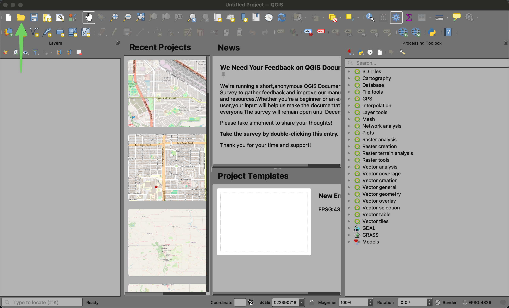

# Getting Started

## Prerequisites

- You need to install the software described in the [README.md](../README.md) file at the root of the project
- You will need to download this project from GitHub as described in the [README.md](../README.md) file at the root of the project
- You need to download the needed data as described in the [data-sources-guide.md](./data-sources-guide.md) in the docs folder of the project

## How to Run a Tool

### Commonalities

All of the tools share a very similar setup so one tool will be shown in detail here and the others will be discussed briefly to note their differences. It is useful to create tools that utilize as similar a setup as possible to one another to minimize the learning curve for using a toolset. In this case, all of the tools share the same processing setup and all make use of two particular pieces of data from one of the data sources. The setup for each tool uses the exact same naming conventions for these pieces of data to simplify the experience as much as possible.

### Example of Tool Setup and Use

Open QGIS and then select the folder icon to open an existing project file

The project file will be located in the housing_toolkit folder you downloaded (see the [prerequisites section](#prerequisites )). You will find the specific project files (one for each tool) in the qgis_projects folder

Open the project file for the tool you wish to use. In this case we are using the Governmental Assistance by Census Tract tool.

Once the project is opened, you will need to run the tool itself. Use the gear icon to open the processing toolbox, expand the section at the bottom called "project models", and double click the tool contained inside.

The window that pops up is where you will define the data sources for the tool to make use of. All of the tools in this toolkit require the first two fields for Census Tracts and States. To fill them in click the elipses (...) and choose "Browse for Layer". It is important to use this layer and not the file for this step.

Use the folder tree that appears to browse to the place where you stored the TIGER/Line GeoPackage you downloaded and expand it so that it shows its layers.

Choose the layer Census_Tract by double clicking on it

Repeat the "Browse for Layer" step for State Lines Data this time and select the layer from the GeoPackage called "State"

This step varies by tool and will need you to use "Select File" this time to located the data you downloaded from HUD or the Census Data website.

In this case we are looking for the public assistance data we downloaded and are selecting the file that contains the data (ends in -Data.csv). In other cases you will want to select the appropriate data source for the tool you are running.

At this point you should have all of the required fields filled in and will be able to run the tool. Click Run in the lower right to do so

Running the tool will bring up the log. It is normal to see some errors regarding some features not being matched. The tool expects this and will handle it appropriately. When the status bar shows it is complete you can click the "Close" button in the bottom right.

Now you should see something that looks like this

You can use the hand or magnifying glasses to pan the map around and zoom in and out to look at any place in the United States.

When examining areas it can be helpful to get exact information on a given census tract. To do this click the Identify button on the toolbar (shown below) and then click on any census tract on the map itself. You will see a panel appear that will say "Identify Results". In this case it gives us the number of folks in the tract, the number on assistance, and the percentage of people in the tract they represent. You can see the Percentage_Assistance matches the color assigned on the left in the Layers pane. To stop using Identify you can click the hand icon again to pan the map around.

### Tool Differences

The data for the occupancy type tool is also a csv file as shown in this example

The data from HUD/USPS regarding vacancies is a dbf file type but loads the same way via the Select File choice

Both the vacancy tool and the occupancy type tool use the exact same proceedure defined above for selecting the Census and State Lines data. They also work the same when it comes to navigating the maps and getting specific info via the Identify tool.